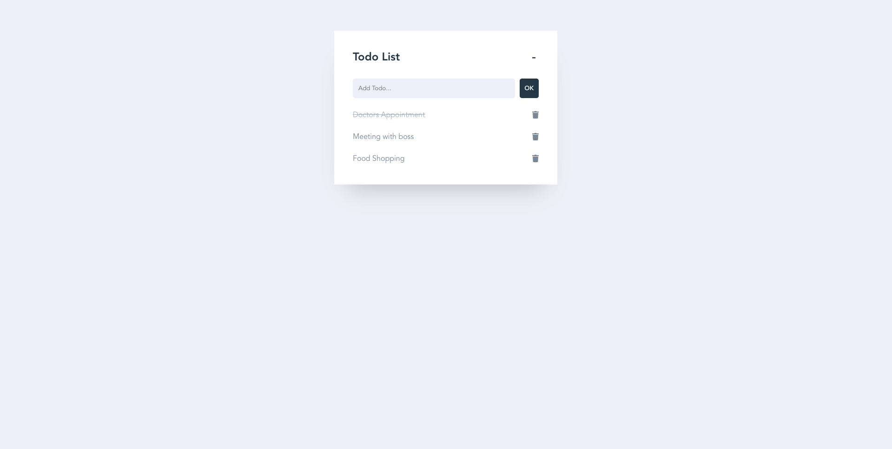

# To-do list

A simple project made to learn more about Vue.js and Vuex. A list for you put your to-do for the day. 



## Technologies 
- Vue.js
- Vuex
- JSON Server


## To use the application

### Install dependencies
```
npm install
```

### Start JSON Server
```
npm run backend
```

### Compiles and hot-reloads for development
```
npm run serve
```


